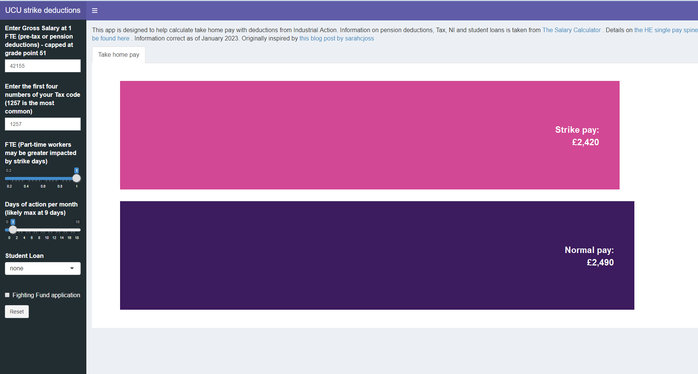

## Project description

Working out the impact of industrial action on take-home (net) pay can be complicated by the fact that deductions are calculated on gross pay (before tax and other deductions). The impact on net pay will be affected by pension deductions, tax codes, NI contributions, and student loan deductions and the impact on your take-home may be less than you think. 

This app allows you to input Gross salary, Tax codes, Hours relative to full-time equivalent (FTE), Student loan deductions (England only) and applications to the UCU fighting fund and see the impact on pay. 

Inspired by reading [https://medium.com/@sarahcjoss/the-net-cost-of-striking-8493018ead3f]

*Disclaimer: all figures are approximate and dependent on how your employer takes deductions (I have assumed 1/365 deductions per day of action). Assuming there are no additional deductions for partial performance relating to Action Short of a Strike. There will almost certainly be errors if you spot any please let me know.*




## Data

Data on Tax codes, National Insurance contributions, Student loan repayment plans is taken from [The Salary Calculator](https://www.thesalarycalculator.co.uk/salary.php) and is correct as of January 2023. 

HE Single Pay Spine information can be found here [https://www.ucu.org.uk/he_singlepayspine]

Pension contributions calculated at 9.8% [https://www.uss.co.uk/for-members/youre-a-new-joiner/what-youll-pay]

Deductions for industrial action calculate at 1/365 per day of action. For calculations for those in part-time work - deductions for declared days of action are scored accordingly e.g working at 0.4FTE would result in each day of action being deducted at 1/146. 


## Requirements

```
R version 3.6.2

```

### Packages

Available on CRAN

```
 [1] scales_1.1.1             forcats_0.5.1            stringr_1.4.0           
 [4] dplyr_1.0.6              purrr_0.3.4              readr_2.1.1             
 [7] tidyr_1.1.3              tibble_3.1.1             ggplot2_3.3.6           
[10] tidyverse_1.3.1          shinydashboardPlus_2.0.3 shinycssloaders_1.0.0   
[13] shinydashboard_0.7.2     shiny_1.7.1              extrafont_0.17  

```
